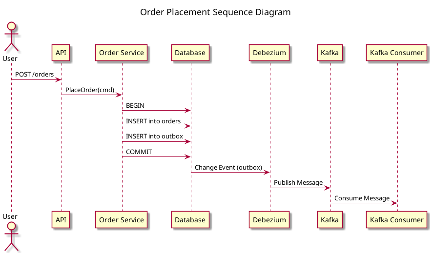
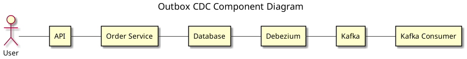

# Outbox CDC

This project is an example of the outbox pattern with change data capture (CDC) using Go, PostgreSQL, Debezium, and Kafka.

## Overview

The outbox pattern is a way to safely and reliably publish events from a microservice. It ensures that events are published if and only if the corresponding database transaction is committed.
This project demonstrates the outbox pattern with a simple order service. When a user places an order, the service saves the order to the `orders` table and an event to the `outbox` table in the same transaction. Debezium, a CDC tool, monitors the `outbox` table and publishes the events to a Kafka topic.

## Diagrams

The PlantUML source files (`.puml`) for the diagrams are located in the `diagrams/` directory.
To view the rendered images (e.g., PNGs), you will need to generate them from the `.puml` files using a PlantUML tool.

### Sequence Diagram



### Component Diagram



## How to run the project

1.  **Start the infrastructure:**
    ```bash
    docker-compose up -d
    ```
2.  **Run the application:**
    ```bash
    go run main.go
    ```
3.  **Place an order:**
    ```bash
    curl -X POST http://localhost:9000/orders -d '{"item_id": 1, "quantity": 2, "estimated_price": 100}'
    ```
4.  **View the consumed messages:**
    ```bash
    docker logs -f outbox_cdc_kafka_consumer
    ```
